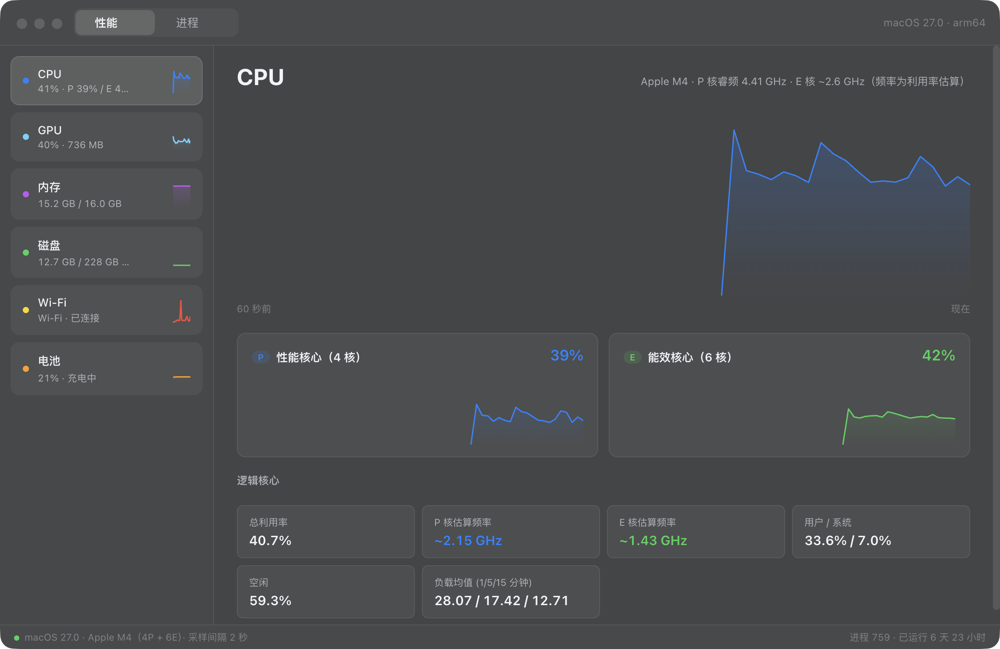
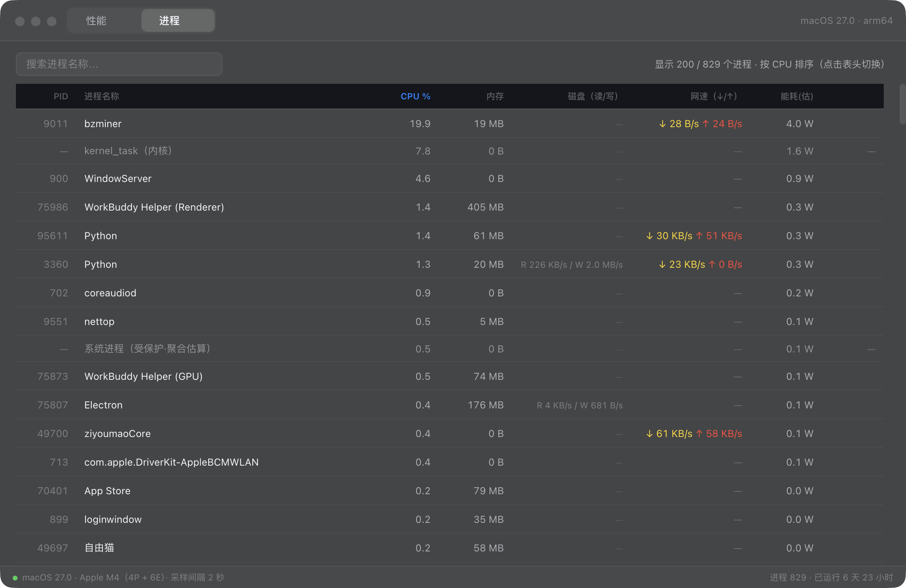
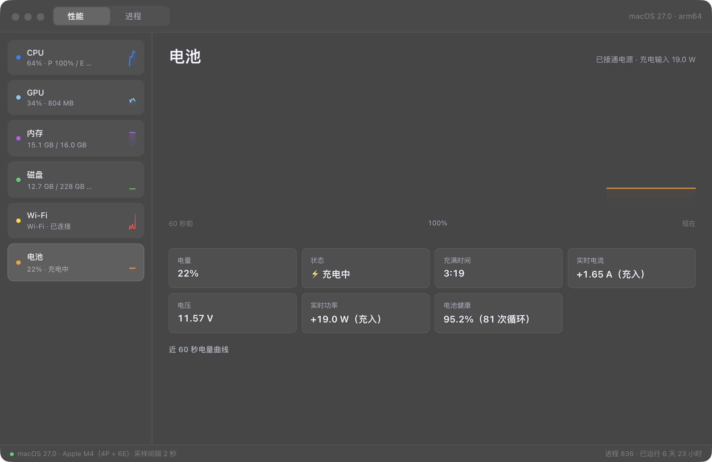
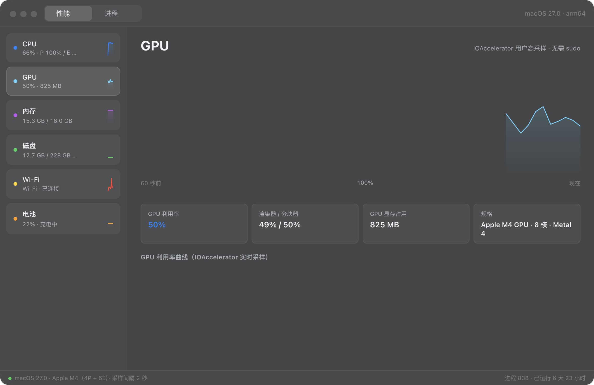

# Mac 任务管理器（mac-task-manager）

为 Apple Silicon Mac 打造的 Electron 任务管理器，模仿 Windows 11 任务管理器的布局逻辑，采用 macOS 原生视觉（毛玻璃 vibrancy / SF Pro / hairline）。

## 预览

**性能页** — CPU 总览 + 性能/能效核心分离 + 每核实时小图块 + 估算频率：



**进程页** — 880+ 进程全量枚举（含系统进程），七列实时数据：整机占比 CPU、内存、磁盘读/写、网速 ↓↑、能耗（瓦数）：



**电池页** — 实时电压 / 电流 / 功率 + 循环次数与健康度，充放电状态自动切换：



**GPU 页** — 利用率 / 渲染器 / 分块器 / 显存（IOAccelerator 用户态采样）：



## 特性

- **性能核心 / 能效核心分离**：自动识别 P/E 核心数量（如 M4 = 4P + 6E），双面板独立曲线 + 每核实时小图块
- **每核实时监测**：内置 Swift 助手直读 Mach `host_processor_info`，逐核 tick 差分计算占用率（macOS 27 已移除 `kern.cp_time/cp_times`，此为最可靠方案），无需 sudo
- **内存**：统一内存占用、App/Wired/压缩/非活跃构成、Swap、压缩器压力
- **磁盘**：`iostat` 内核级 1 秒窗口吞吐 + IOPS + APFS 全部卷容量
- **网络**：Wi-Fi SSID、收发双曲线、开机累计流量、全部 en 接口
- **电池**：实时电压 / 电流 / 功率（充入为正、放电为负）+ 电量曲线 + 循环次数与健康度，充放电状态自动切换
- **GPU**：`ioreg` 读取设备 / 渲染器 / 分块器利用率与显存占用（Apple Silicon 集成 GPU）
- **进程**：全量枚举 880+ 进程（含 WindowServer 等系统进程），7 列实时数据——CPU（整机占比口径，最大 100%）、内存、磁盘读/写、网速 ↓/↑、能耗（瓦数估算），可排序、可搜索、一键强制退出（带确认）
- 快捷键：`⌘1` 性能 / `⌘2` 进程 / `Esc` 清空搜索

## 构建

依赖：macOS + Xcode Command Line Tools（swiftc）+ Node.js 22+

```bash
./build.sh   # 编译助手 → npm 安装 Electron → 打包 → ad-hoc 签名 → 安装到 /Applications 并启动
```

## 手动开发运行

```bash
npm install electron@37
env -u ELECTRON_RUN_AS_NODE ./node_modules/electron/dist/Electron.app/Contents/MacOS/Electron .
```

> 注：从终端启动需加 `--no-sandbox`（受宿主沙箱环境影响时）；从 Finder/启动台正常打开无需任何参数。

## 结构

```
main.js        # Electron 主进程：窗口 + 全部系统数据采集（分层轮询 2s/6s）
preload.js     # contextBridge 安全桥
index.html     # 布局与 macOS 风格设计系统
renderer.js    # 渲染进程：侧栏卡片 / P+E 核面板 / 图表 / 进程表
cpucores.swift # 每核 CPU tick 采样助手（编译为 bin/cpucores）
procinfo.swift # 全量进程枚举 + 资源采集助手（编译为 bin/procinfo）
icon.swift     # 程序化绘制 App 图标
build.sh       # 一键构建打包脚本
```

## macOS 27 适配说明

新版 macOS 移除了若干传统接口，本项目已针对性处理（这些坑在其它监控工具里普遍存在）：

- `kern.cp_time` / `kern.cp_times` 已被移除 → 改用 Mach `host_processor_info` 逐核采样
- `kinfo_proc.p_cpticks` 恒为 0 → 进程 CPU 改用 `PROC_PIDTASKINFO` 纳秒累计时间
- `PROC_PIDTASKINFO` / `proc_pid_rusage` **不计 darwinbg/nice（后台 QoS）线程**的 CPU 时间，挖矿等后台负载会"隐身" → 进程 CPU 取 `max(任务级差分, ps %cpu)`，并补充 `kernel_task` 行与受保护系统进程聚合行
- WindowServer 等 root 进程的 taskinfo 读取被拒 → 走聚合估算行，保证进程页合计与性能页总利用率对得上
- Apple Silicon 无用户态 CPU 频率接口 → 按利用率 × 睿频区间估算（P ≤ 4.41 GHz / E ≈ 2.6 GHz）

## 许可

MIT
